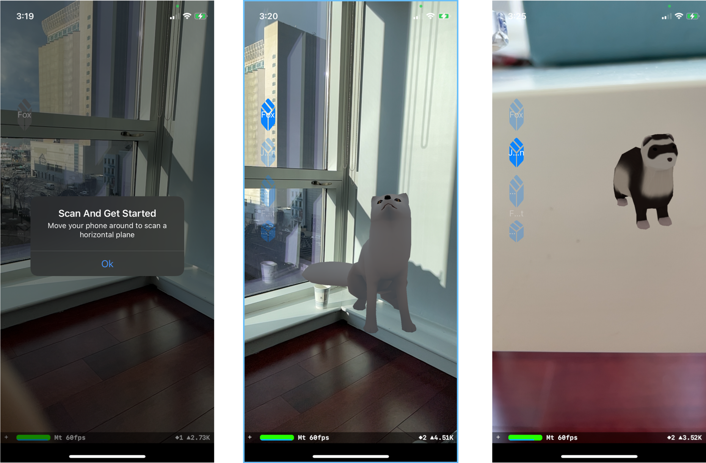
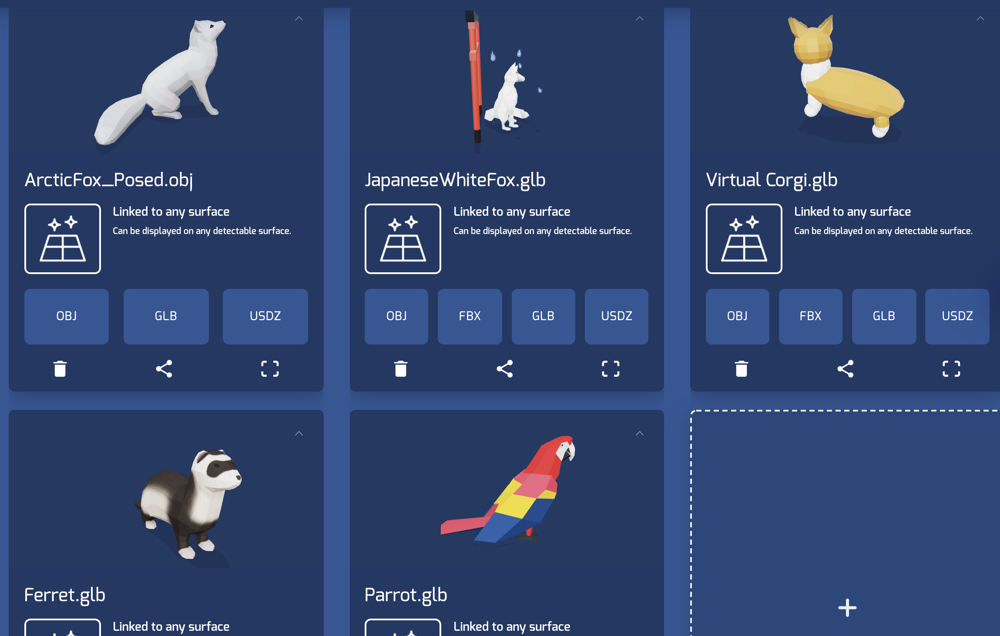

# iOS ARKit demo: Pet
Demo is a tabletop augmented reality iOS demo app, built with the echoAR Swift SDK, that allows users
to choose their favourite pets.

**By Yuhan Yin**

-------------------------

## Build and Run
1. Make sure you have Xcode downloaded
2. clone this repository
3. Go to the "Signing&Capabilities" tab on Xcode and fill out your signing
  information. See more details [here](https://docs.echoar.xyz/swift/adding-ar-capabilities) 
4. Go to the EchoAR.swift file, insert api key
5. Go to the echoAR console and add the 3d content
6. Go to the ViewController.swift file, add the entry id's for 3d content
7. Connect iPhone to your computer.
8. Press the play button to build an run (Note: your device must be unlocked to run)
9. Use postman to get `entryId` for each model

## Using The Demo
1. Move your phone around a horizontal surface to scan a plane.
2. The fox pet is selected by default
3. Use other buttons to change your pet. Choices are Fox, Ferret, Parrot, JapanFox and Corgi.

## Screenshots

### Images of the default entries for the demo
